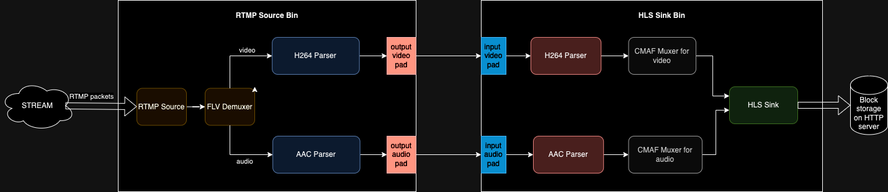
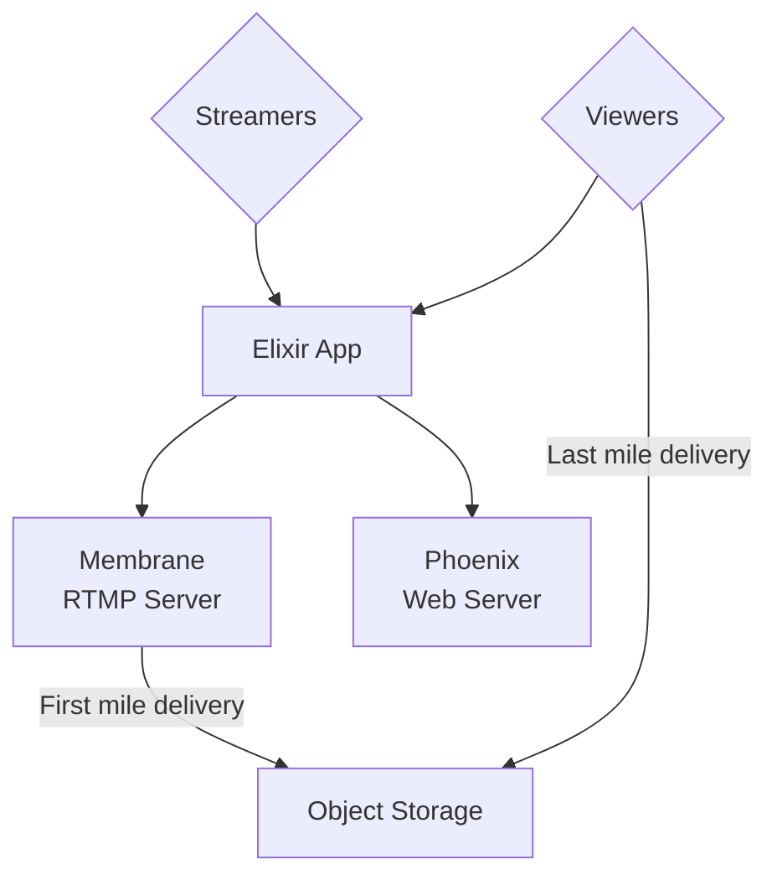
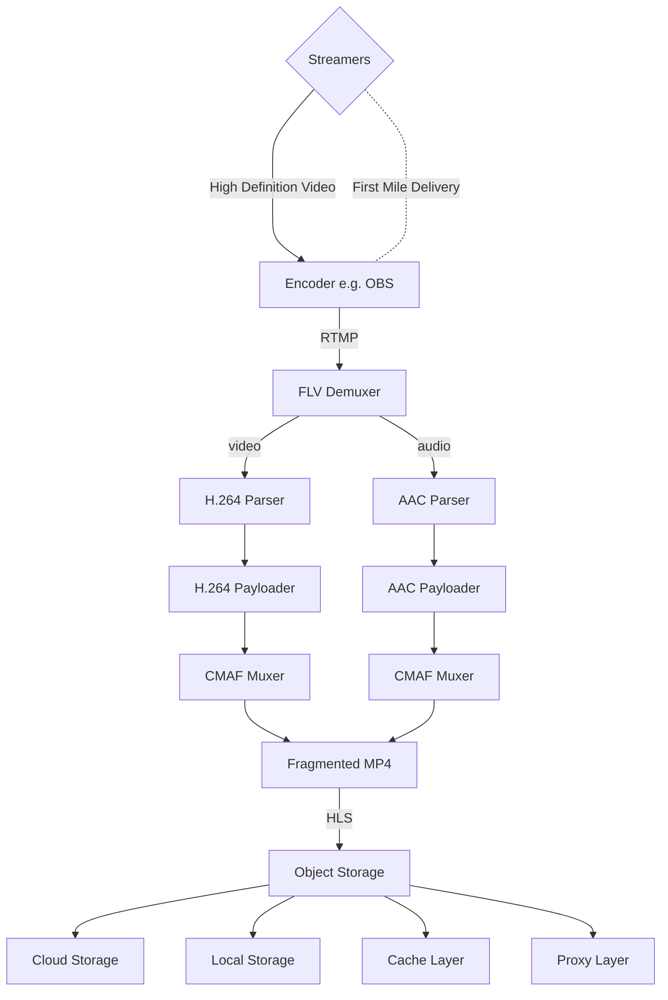
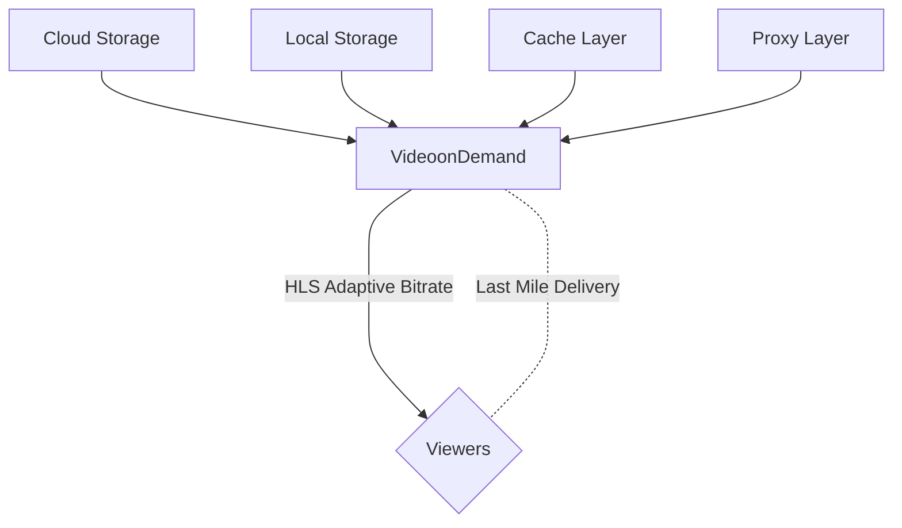

# Live Streaming Service with Membrane and Elixir

----

## Table of Contents

1. [Introduction](#introduction)
2. [Service Structure](#service-structure)
3. [Build Project](#build-project)
4. [Technologies Used](#technologies-used)
5. [API Architecture and System Design](#api-architecture-and-system-design)
    1. [Software Requirements and Needs](#software-requirements-and-needs)
    2. [Live Streaming Architecture Overview](#live-streaming-architecture-overview)
    3. [System Design](#system-design)
    4. [Architecture Graph](#architecture-graph)
    5. [Pipeline Graphes](#pipeline-graphes)
        1. [First Mile Delivery](#first-mile-delivery)
        2. [Last Mile Delivery](#last-mile-delivery)
    6. [Protocol Choices](#protocol-choices)
    7. [Codecs Choices](#codecs-choices)
6. [Contributing](#contributing)
7. [Licencse](#license)

## Introduction

A Live Streaming Service that supports connection through ***RTMP*** and stream the incoming stream using ***Adaptive Bitrate Streaming with HLS***.

## Service Structure

The project is divided into 2 parts:

- Phoenix API with Membrane Pipelines.
- Svelte FrontEnd.

## Build Project

1. Clone this repository: `git clone https://github.com/medhedibenali/neon_backend.git` or `git clone git@github.com:medhedibenali/neon_backend.git`.
2. Make sure you have Elixir and nodejs installed.
3. In the API, Run `mix setup` and then `mix phx.server`.
4. In the Interface, Run `npm install`, `then npm run dev`.

## Technologies Used

- Elixir
- Phoenix
- Membrane
- NPM
- Svelte Kit
- RTMP
- Adaptive Bitrate Streaming (HLS)

## API Architecture and System Design

### Software Requirements and Needs

We are building a Live Streaming Platform. Scalability, Low-Latency, Fault-Tolerance, Load-Tolerance, and Consistent Stream are a must.

So our system must:

- receive streams in high-resolution without data loss and in low latency.
- perform real-time processing.
- provide high-throughput for worldwide distribution at scale.

***offering end-to-end low latency video experience.***

### Live Streaming Architecture Overview

These are the main components of the System:

1. Video Ingestion:
    - ***First Mile Delivery*** on top of ***RTMP***. Streamers must stream in high definition and high quality. No information must be lost. The protocol used must be used on top of ***TCP***. *RTMP* is used because it is a *TCP Protocol* that is known for its *wide support* as well as its *low-latency*.
2. Transcoding:
    - Transcodes incoming high-definition video to different resolutions and protocols. (Compute-Intensive).
    - These are the chosen codecs:

        - ***AAC*** (Advanced Audio Codec).
        - ***H.264*** (MPEG-4 AVC (Advanced Video Codec)).

3. Distribution & Caching.
4. Video on Demand:
    - Video transfered to clients through ***adaptative bitrate protocols***:
        - ***HLS***
        - ***MPEG-DASH***

### System Design

For the current implementation which is simplified, we have ***only one pipeline of data*** (video chunks) with ***one operator***, the ***transcoder***, else we have the source which is the RTMP ingestion and the sink which is the HLS distribution.

Our System will be then divided into *2 big parts*:

1. ***Source Bin***: Video Ingestion + Transcoding. (***RTMP***).
2. ***Sink Bin***: Distribution & Caching + Video on Demand. (***HLS***).

### Architecture Graph

### Pipeline Graphes

#### First Mile Delivery

#### Last Mile Delivery

### Protocol Choices

- ***RTMP***:

    RTMP (Real-Time Messaging Protocol) is a live video streaming technology that built on top of **TCP** and works by slicing high-definition video files into smaller pieces and send them one by one.

    These features made RTMP the defacto streaming protocol for long and here is mainly why:
  - Its Low Latency.
  - Its reliable and consistent data delivery meaning no part of the stream is lost.
  - Adapted by Most platforms.

  However:

  - Mobile and Browser technologies do not widely support RTMP.
  - It doesn't support adaptive bitrate streaming (ABS) and so doesn't adapt to the connection quality changes in the client side.

  Making it perfect for **First Mile Delivery**.

- ***HLS***:

    HLS (HTTP Live Streaming) is a live video streaming technology that built on top of **HTTP** breaking down video files into smaller chunks delivered using the HTTP protocol.

    It incorporates ***adaptive bitrate streaming (ABS)*** adjusting the video quality based on the viewer’s available internet bandwidth making the **viewing experience smoother**.

    However, HLS suffers from a **High Latency Problem** (up to 6-10 seconds).

  Making it perfect for **Last Mile Delivery**.

### Codecs Choices

- ***AAC*** (Advanced Audio Codec).
- ***H.264*** (MPEG-4 AVC (Advanced Video Codec)).

These were chosen because of their reliability and wide support in almost all devices nowadays.

## Contributing

***We are always pleased to receive your suggestions, criticism and corrections. We want this service to be a defacto boilerplate for live streaming projects in the future. Your contributions mean a lot.***

We welcome contributions to the project. To contribute, please follow these steps:

1. Fork the repository
2. Create a new branch (`git checkout -b feature/your_feature`)
3. Make your changes
4. Commit your changes (`git commit -am 'Add new feature'`)
5. Push to the branch (`git push origin feature/your_feature`)
6. Create a new Pull Request

Please ensure your code follows the project's coding standards and include tests if applicable.

## License

This project is licensed under the [MIT License](LICENSE).
