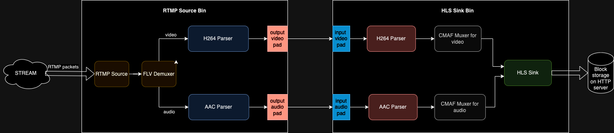

# Live Streaming Service with Membrane and Elixir

A Live Streaming Platform that supports connection through ***RTMP*** and stream the incoming stream using ***Adaptive Bitrate Streaming with HLS***.

## Technologies Used

- Elixir
- Membrane
- RTMP
- Adaptive Bitrate Streaming (HLS)

## Architecture Requirements and Needs Study

We are building a Live Streaming Platform. Scalability, Low-Latency, Fault-Tolerance, Load-Tolerance, and Consistent Stream are a must.

So our system must:

- receive streams in high-resolution without data loss and in low latency.
- perform real-time processing.
- provide high-throughput for worldwide distribution at scale.

***offering end-to-end low latency video experience.***

## Architecture Overview

These are the main components of the System:

1. Video Ingestion:
    - ***First Mile Delivery*** on top of ***RTMP***. Streamers must stream in high definition and high quality. No information must be lost. The protocol used must be used on top of ***TCP***. *RTMP* is used because it is a *TCP Protocol* that is known for its *wide support* as well as its *low-latency*.
2. Transcoding:
    - Transcodes incoming high-definition video to different resolutions and protocols. (Compute-Intensive).
3. Distribution & Caching.
4. Video on Demand:
    - Video transfered to clients through ***adaptative bitrate protocols***:
        - ***HLS***
        - ***MPEG-DASH***

## System Design

For the current implementation which is simplified, we have ***only one pipeline of data*** (video chunks) with ***one operator***, the ***transcoder***, else we have the source which is the RTMP ingestion and the sink which is the HLS distribution.

Our System will be then divided into *2 big parts*:

1. ***Source Bin***: Video Ingestion + Transcoding. (***RTMP***).
2. ***Sink Bin***: Distribution & Caching + Video on Demand. (***HLS***).

## Service Structure

All service files are found in the `live_streaming_platform` folder alongside the **BUILD & USE GUIDE** in the [README](./live_streaming_platform_service/README.md).
