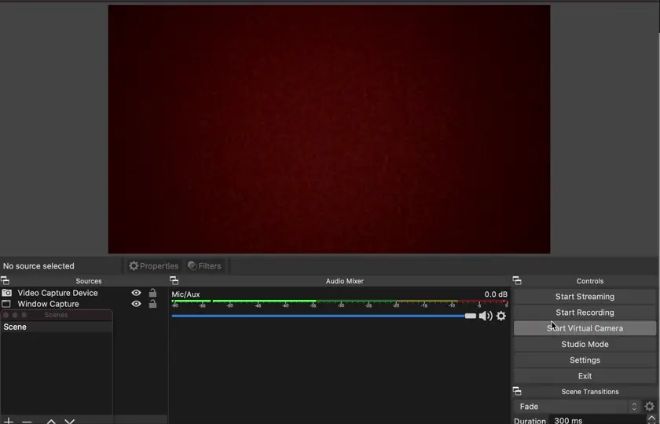

# Set UP an RTMP Stream with OBS

You can send RTMP stream onto `localhost:<PORT>` with your favorite streaming tool. 

Here is how to generate an RTMP stream with [OBS](https://obsproject.com).

Once you have OBS installed, you can perform the following steps:

1. Open the OBS application
2. Open the `Settings` windows
3. Go to the `Stream` tab, set `Service` to `Custom...` and then set the value in the `Server` field to `rtmp://localhost:9006` (the address where the server is waiting for the stream)
4. Go to the `Output`, set output mode to `Advanced`, and set `Keyframe Interval` to 2 seconds.
5. Finally, you can go back to the main window and start streaming with the `Start Streaming` button.

Below you can see how to set the appropriate settings (steps 2. and 3. from the list of steps above):

