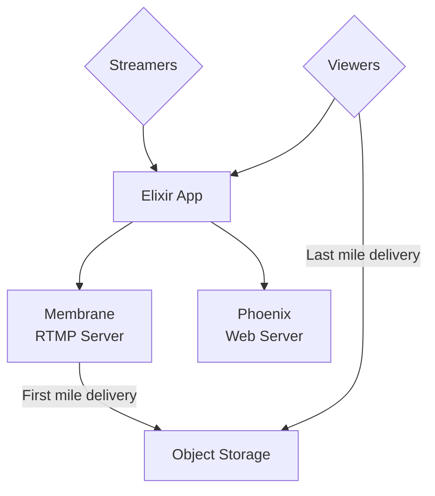
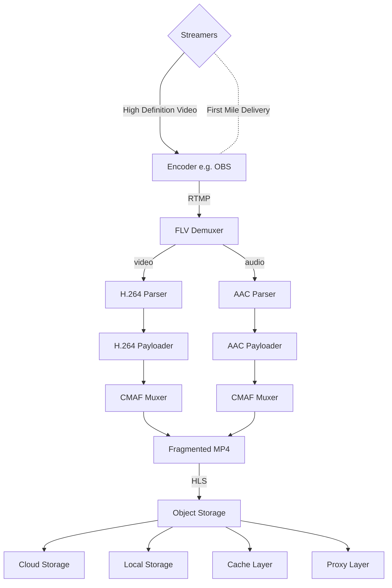
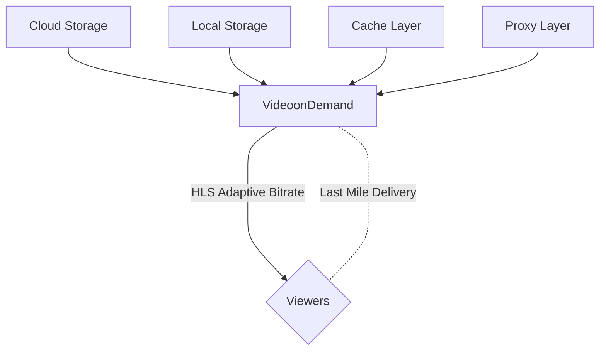

# Pipeline in Elixir and Membrane

## Live Streaming Architecture Overview

These are the main components of the System:

1. Video Ingestion:
    - ***First Mile Delivery*** on top of ***RTMP***. Streamers must stream in high definition and high quality. No information must be lost. The protocol used must be used on top of ***TCP***. *RTMP* is used because it is a *TCP Protocol* that is known for its *wide support* as well as its *low-latency*.
2. Transcoding:
    - Transcodes incoming high-definition video to different resolutions and protocols. (Compute-Intensive).
    - These are the chosen codecs:

        - ***AAC*** (Advanced Audio Codec).
        - ***H.264*** (MPEG-4 AVC (Advanced Video Codec)).

3. Distribution & Caching.
4. Video on Demand:
    - Video transfered to clients through ***adaptative bitrate protocols***:
        - ***HLS***
        - ***MPEG-DASH***

## System Design

For the current implementation which is simplified, we have ***only one pipeline of data*** (video chunks) with ***one operator***, the ***transcoder***, else we have the source which is the RTMP ingestion and the sink which is the HLS distribution.

Our System will be then divided into *2 big parts*:

1. ***Source Bin***: Video Ingestion + Transcoding. (***RTMP***).
2. ***Sink Bin***: Distribution & Caching + Video on Demand. (***HLS***).

## Architecture Graph

## Pipeline Graphes

### First Mile Delivery

### Last Mile Delivery

## Protocol Choices

- ***RTMP***:

    RTMP (Real-Time Messaging Protocol) is a live video streaming technology that built on top of **TCP** and works by slicing high-definition video files into smaller pieces and send them one by one.

    These features made RTMP the defacto streaming protocol for long and here is mainly why:
  - Its Low Latency.
  - Its reliable and consistent data delivery meaning no part of the stream is lost.
  - Adapted by Most platforms.

  However:

  - Mobile and Browser technologies do not widely support RTMP.
  - It doesn't support adaptive bitrate streaming (ABS) and so doesn't adapt to the connection quality changes in the client side.

  Making it perfect for **First Mile Delivery**.

- ***HLS***:

    HLS (HTTP Live Streaming) is a live video streaming technology that built on top of **HTTP** breaking down video files into smaller chunks delivered using the HTTP protocol.

    It incorporates ***adaptive bitrate streaming (ABS)*** adjusting the video quality based on the viewer’s available internet bandwidth making the **viewing experience smoother**.

    However, HLS suffers from a **High Latency Problem** (up to 6-10 seconds).

  Making it perfect for **Last Mile Delivery**.

## Codecs Choices

- ***AAC*** (Advanced Audio Codec).
- ***H.264*** (MPEG-4 AVC (Advanced Video Codec)).

These were chosen because of their reliability and wide support in almost all devices nowadays.
